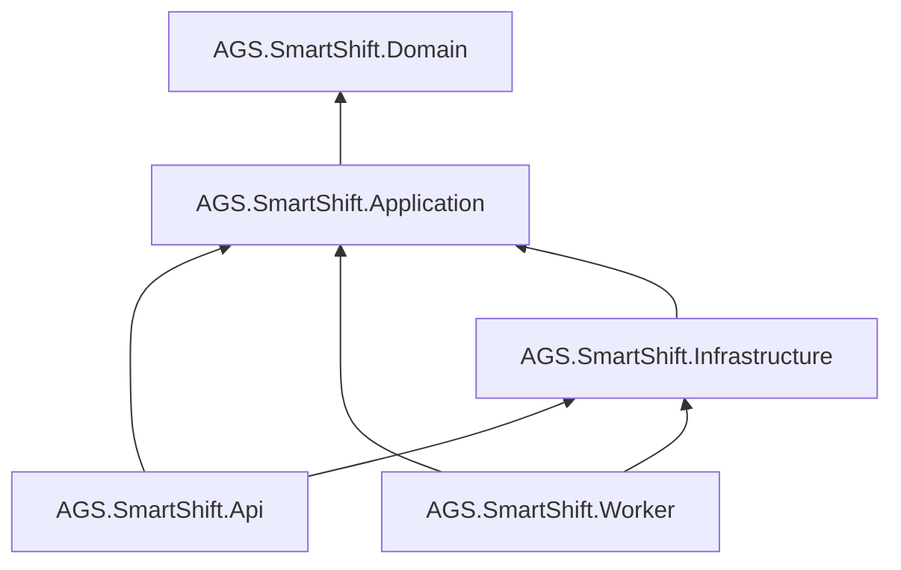

# Backend — Cấu trúc solution chi tiết

> ASP.NET Core 8 · Clean Architecture · PostgreSQL + PostGIS · SignalR (no Redis)  
> Dependency: `Api` → `Application` → `Domain` ← `Infrastructure` implements ports

---

## 1. Tổng quan solution

```
production/backend/
├── AGS.SmartShift.sln
├── Directory.Build.props          # Version, nullable, analyzers chung
├── Directory.Packages.props       # Central Package Management (CPM)
├── .editorconfig
├── .env.example                   # legacy; Docker env → production/.env
├── README.md
├── STRUCTURE.md                   # File này
│
├── openapi/
│   └── v1.yaml                    # OpenAPI export (build / CI artifact)
│
├── scripts/
│   ├── dev-up.sh                  # → production/scripts/dev-up.sh
│   └── ef-migrate.sh              # dotnet ef database update
│
├── src/
│   ├── AGS.SmartShift.Domain/
│   ├── AGS.SmartShift.Application/
│   ├── AGS.SmartShift.Infrastructure/
│   ├── AGS.SmartShift.Api/
│   └── AGS.SmartShift.Worker/
│
└── tests/
    ├── AGS.SmartShift.Domain.UnitTests/
    ├── AGS.SmartShift.Application.UnitTests/
    ├── AGS.SmartShift.ArchitectureTests/      # NetArchTest layer rules
    ├── AGS.SmartShift.Api.IntegrationTests/
    └── AGS.SmartShift.Infrastructure.IntegrationTests/
```

---

## 2. Domain (`AGS.SmartShift.Domain`)

**Không reference** project nào khác. Chỉ primitives + domain logic.

### 2.1 Base entity — hierarchy (bắt buộc)

**Trạng thái**: đã thiết kế trong spec; **chưa có code** (Sprint 1 tạo lớp base trước entity cụ thể).

Mục tiêu: một pattern chung — EF mapping, API JSON, OpenAPI → TypeScript FE/Mobile **cùng hình dạng**, tránh mỗi nơi tự định nghĩa `id` / audit khác nhau.

```text
Entity<TId>                    # Id bắt buộc
└── AuditableEntity<TId>       # CreatedAtUtc, UpdatedAtUtc, RowVersion (optimistic lock)
    └── AggregateRoot<TId>     # Domain events (ICollection<IDomainEvent>)
```

| Lớp | Thuộc tính | Entity kế thừa |
|-----|------------|----------------|
| `Entity<Guid>` | `Id` | Hầu hết aggregate |
| `AuditableEntity<Guid>` | + `CreatedAtUtc`, `UpdatedAtUtc`, `RowVersion` | `Flight`, `ShiftSlot`, `AttendanceRecord`, … |
| `AggregateRoot<Guid>` | + domain events | `WeeklyPlan`, `ShiftAssignment`, `AttendanceRecord` |
| `Entity<long>` | `Id` bigint | `LocationSample` (volume cao, không cần full audit) |

**Value object ID** (tuỳ chọn Sprint 2+): `EntityId` wrap `Guid` — tránh truyền nhầm `Guid` thường.

**Không kế thừa `AuditableEntity`**: `AuditEvent` (append-only), bảng join đơn giản.

```csharp
// Domain/Common — hợp đồng (minh hoạ)
public abstract class Entity<TId> where TId : struct, IEquatable<TId>
{
    public TId Id { get; protected set; }
}

public abstract class AuditableEntity<TId> : Entity<TId> where TId : struct, IEquatable<TId>
{
    public DateTime CreatedAtUtc { get; protected set; }
    public DateTime? UpdatedAtUtc { get; protected set; }
    public byte[] RowVersion { get; private set; } = default!;  // EF concurrency token
}

public abstract class AggregateRoot<TId> : AuditableEntity<TId> where TId : struct, IEquatable<TId>
{
    private readonly List<IDomainEvent> _events = [];
    public IReadOnlyCollection<IDomainEvent> DomainEvents => _events.AsReadOnly();
    protected void Raise(IDomainEvent e) => _events.Add(e);
    public void ClearDomainEvents() => _events.Clear();
}
```

**Infrastructure** — mapping một chỗ:

```
Persistence/Configurations/Common/
├── EntityConfiguration.cs           # PK, conventions
├── AuditableEntityConfiguration.cs  # CreatedAtUtc, UpdatedAtUtc, RowVersion
└── (per-entity *Configuration.cs)
```

**Application / API** — DTO base (JSON cho FE & Mobile):

| C# (Contracts) | JSON field | Ghi chú |
|----------------|------------|---------|
| `ResourceDto` | `id` | `string` UUID |
| `AuditableResourceDto` | `createdAt`, `updatedAt` | ISO-8601 **UTC** |
| `ProblemDetails` | RFC 7807 | lỗi thống nhất |

**Đồng bộ FE + Mobile — không copy C#**:

1. **OpenAPI** (`backend/openapi/v1.yaml`) = nguồn sự thật cho API shape.  
2. **openapi-typescript** → `frontend/src/shared/api/generated/`.  
3. Mobile dùng **cùng generated** (monorepo package hoặc copy CI artifact).  
4. Enum string khớp backend: `planStatus: "in_progress"` (camelCase JSON).

Chi tiết monorepo contracts: [`../shared/README.md`](../shared/README.md).

```
AGS.SmartShift.Domain/
├── AGS.SmartShift.Domain.csproj
├── GlobalUsings.cs
│
├── Common/
│   ├── Entity.cs
│   ├── AuditableEntity.cs
│   ├── AggregateRoot.cs
│   ├── ValueObject.cs
│   ├── IDomainEvent.cs
│   ├── DomainException.cs
│   └── IAuditable.cs              # marker nếu cần reflection
│
├── Enums/
│   ├── PlanStatus.cs              # Draft, Published, InProgress, Closed
│   ├── UserRole.cs                # Hr, Sup, Staff
│   ├── AttendanceMethod.cs        # Geofence, ManualOverride, …
│   └── OperationalDayPolicy.cs    # Site timezone rules (stub)
│
├── ValueObjects/
│   ├── GeoCoordinate.cs           # Lat/Lng double, accuracy
│   ├── GeoPolygon.cs              # Ring WGS84, point-in-polygon
│   ├── ShiftSegment.cs            # "07-21", hours helper
│   ├── WeekId.cs                  # "2026-W20"
│   └── DateRange.cs
│
├── Entities/                      # Theo bounded context
│   ├── Identity/
│   │   ├── Site.cs
│   │   ├── Department.cs
│   │   ├── Employee.cs
│   │   └── UserAccount.cs
│   ├── FlightOps/
│   │   └── Flight.cs
│   ├── WorkforcePlanning/
│   │   ├── WeeklyPlan.cs
│   │   ├── ShiftSlot.cs
│   │   └── ShiftRevision.cs       # Cờ SĐ
│   ├── Assignment/
│   │   └── ShiftAssignment.cs
│   ├── Attendance/
│   │   ├── AttendanceRecord.cs
│   │   └── LocationSample.cs
│   ├── Monitoring/
│   │   └── WorkZone.cs            # Polygon version
│   └── Notifications/
│       └── Notification.cs
│
├── Services/                      # Domain services (pure logic)
│   ├── GeofenceService.cs         # Point-in-polygon + ε tolerance
│   ├── GpsVelocityValidator.cs    # Anti-teleport rules
│   ├── PastDayGuard.cs            # dayIdx < todayIdx
│   ├── FlightSlotOverlap.cs       # STA/STD vs segments
│   └── AttendanceCodeCalculator.cs  # Port interface + default impl OR interface only
│
└── Repositories/                  # Chỉ **interfaces** (ports)
    ├── IUnitOfWork.cs
    ├── IAttendanceRepository.cs
    ├── IAssignmentRepository.cs
    ├── IFlightRepository.cs
    ├── IWeeklyPlanRepository.cs
    ├── IWorkZoneRepository.cs
    ├── IEmployeeRepository.cs
    └── IAuditEventStore.cs
```

---

## 3. Application (`AGS.SmartShift.Application`)

**Reference**: `Domain` only.  
**Pattern**: CQRS nhẹ — `Features/{Context}/{Command|Query}/`.

```
AGS.SmartShift.Application/
├── AGS.SmartShift.Application.csproj
├── DependencyInjection.cs         # AddApplication()
│
├── Common/
│   ├── Behaviors/
│   │   ├── ValidationBehavior.cs    # FluentValidation pipeline
│   │   ├── LoggingBehavior.cs
│   │   └── TransactionBehavior.cs
│   ├── Interfaces/
│   │   ├── ICurrentUser.cs
│   │   ├── IDateTimeProvider.cs
│   │   ├── IIdempotencyStore.cs
│   │   └── IRealtimePublisher.cs    # SignalR abstraction
│   ├── Models/
│   │   ├── Result.cs
│   │   └── PagedList.cs
│   └── Mappings/
│       └── MappingProfile.cs        # AutoMapper hoặc manual extensions
│
├── Contracts/                     # DTO request/response (API-facing)
│   ├── Auth/
│   ├── Flights/
│   ├── Plans/
│   ├── Assignments/
│   ├── Attendance/
│   ├── Monitoring/
│   ├── Reconcile/
│   └── Admin/
│
└── Features/
    ├── Identity/
    │   ├── Login/
    │   │   ├── LoginCommand.cs
    │   │   ├── LoginCommandHandler.cs
    │   │   └── LoginCommandValidator.cs
    │   └── RefreshToken/
    │
    ├── FlightOps/
    │   ├── ListFlights/
    │   ├── ImportFlights/           # Enqueue job
    │   ├── ApplyFlightDelay/
    │   └── GetSyncProposal/
    │
    ├── WorkforcePlanning/
    │   ├── GetPlan/
    │   ├── GenerateSlots/
    │   ├── PublishPlan/
    │   └── ResetPlan/
    │
    ├── Assignment/
    │   ├── GetSupBoard/
    │   ├── AssignEmployee/
    │   ├── RemoveAssignment/
    │   └── LinkFlights/
    │
    ├── Attendance/
    │   ├── CheckIn/                 # Idempotency + geofence
    │   ├── CheckOut/
    │   ├── AppendLocationSamples/
    │   └── GetMyToday/
    │
    ├── Monitoring/
    │   ├── GetMonitoringSnapshot/
    │   └── GetEmployeeTrail/
    │
    ├── Reconcile/
    │   ├── GetReconcileSummary/
    │   ├── ExportWeek/              # Enqueue job
    │   └── ExportMonth/
    │
    ├── Revisions/
    │   └── ApplyFlightSync/
    │
    └── Notifications/
        ├── ListInbox/
        └── MarkRead/
```

**Validators**: `*Validator.cs` cạnh mỗi Command (FluentValidation).

---

## 4. Infrastructure (`AGS.SmartShift.Infrastructure`)

**Reference**: `Application`, `Domain`. Implements ports + EF + external integrations.

```
AGS.SmartShift.Infrastructure/
├── AGS.SmartShift.Infrastructure.csproj
├── DependencyInjection.cs         # AddInfrastructure(configuration)
│
├── Persistence/
│   ├── SmartShiftDbContext.cs
│   ├── SmartShiftDbContextFactory.cs   # Design-time migrations
│   ├── Configurations/                 # IEntityTypeConfiguration<>
│   │   ├── AttendanceRecordConfiguration.cs
│   │   ├── ShiftAssignmentConfiguration.cs
│   │   ├── FlightConfiguration.cs
│   │   └── …
│   ├── Migrations/                     # dotnet ef migrations
│   ├── Repositories/
│   │   ├── AttendanceRepository.cs
│   │   ├── AssignmentRepository.cs
│   │   └── …
│   ├── UnitOfWork.cs
│   └── Interceptors/
│       └── AuditSaveChangesInterceptor.cs
│
├── Identity/
│   ├── JwtTokenService.cs
│   ├── PasswordHasher.cs
│   └── CurrentUserService.cs
│
├── Caching/                    # optional IMemoryCache (single instance); no Redis
│   └── (planned)
│   ├── MonitoringSnapshotCache.cs
│   ├── IdempotencyStore.cs
│   ├── DistributedLockService.cs
│   └── RateLimitService.cs
│
├── Realtime/
│   ├── SignalRRealtimePublisher.cs
│   └── ConnectionTrackingService.cs
│
├── Geospatial/
│   ├── PostGisGeofenceQuery.cs        # Phase 2: ST_Contains
│   └── JsonPolygonGeofenceQuery.cs    # v1 fallback
│
├── ImportExport/
│   ├── FlightExcelParser.cs           # Port từ prototype parseFlights*
│   ├── WeekThCongExporter.cs
│   └── MonthThCongExporter.cs
│
├── BackgroundJobs/
│   ├── FlightImportJob.cs
│   ├── ReconcileExportJob.cs
│   └── NotificationDispatchJob.cs
│
└── Logging/
    └── SerilogConfiguration.cs
```

---

## 5. API (`AGS.SmartShift.Api`)

**Reference**: `Application`, `Infrastructure` (chỉ trong Composition Root / `Program.cs`).

```
AGS.SmartShift.Api/
├── AGS.SmartShift.Api.csproj
├── Program.cs
├── appsettings.json
├── appsettings.Development.json
│
├── Extensions/
│   ├── ServiceCollectionExtensions.cs
│   └── WebApplicationExtensions.cs
│
├── Middleware/
│   ├── CorrelationIdMiddleware.cs
│   ├── ExceptionHandlingMiddleware.cs   # RFC 7807 ProblemDetails
│   └── RequestLoggingMiddleware.cs
│
├── Controllers/                   # Hoặc Endpoints/ nếu Minimal API — chọn 1
│   ├── V1/
│   │   ├── AuthController.cs
│   │   ├── FlightsController.cs
│   │   ├── PlansController.cs
│   │   ├── AssignmentsController.cs
│   │   ├── AttendanceController.cs
│   │   ├── MonitoringController.cs
│   │   ├── ReconcileController.cs
│   │   ├── WorkZonesController.cs
│   │   └── AuditController.cs
│   └── HealthController.cs
│
├── Hubs/
│   ├── MonitoringHub.cs
│   └── StaffHub.cs
│
├── Filters/
│   ├── IdempotencyFilter.cs
│   └── DeptScopeAuthorizationFilter.cs
│
├── Authorization/
│   ├── Policies.cs
│   ├── RoleRequirements.cs
│   └── DeptScopeHandler.cs
│
└── OpenApi/
    └── SwaggerConfiguration.cs
```

**Routes**: prefix `/api/v1` (xem `../docs/architecture.md`).

---

## 6. Worker (`AGS.SmartShift.Worker`)

Host riêng cho job dài (import Excel, export payroll).

```
AGS.SmartShift.Worker/
├── AGS.SmartShift.Worker.csproj
├── Program.cs
├── appsettings.json
└── Workers/
    ├── FlightImportWorker.cs
    ├── ReconcileExportWorker.cs
    └── NotificationWorker.cs
```

> Có thể gộp job vào `Api` + `IHostedService` ở giai đoạn đầu; tách `Worker` khi cần scale export/import.

---

## 7. Tests

```
tests/
├── AGS.SmartShift.Domain.UnitTests/
│   ├── Geofence/
│   │   ├── PointInPolygonTests.cs
│   │   └── BoundaryEpsilonTests.cs
│   ├── GpsVelocityValidatorTests.cs
│   └── PastDayGuardTests.cs
│
├── AGS.SmartShift.Application.UnitTests/
│   ├── Attendance/
│   │   └── CheckInCommandHandlerTests.cs
│   └── Assignment/
│       └── LinkFlightsValidatorTests.cs
│
├── AGS.SmartShift.ArchitectureTests/
│   └── LayerDependencyTests.cs    # Domain không bị reference từ Infra
│
├── AGS.SmartShift.Api.IntegrationTests/
│   ├── CustomWebApplicationFactory.cs
│   ├── Fixtures/
│   │   └── PostgresContainerFixture.cs   # Testcontainers
│   ├── Attendance/
│   │   └── CheckInEndpointTests.cs
│   └── Auth/
│       └── AuthorizationTests.cs
│
└── AGS.SmartShift.Infrastructure.IntegrationTests/
    └── Repositories/
        └── AttendanceRepositoryTests.cs
```

---

## 8. Luồng dependency (reference)



---

## 9. Package gợi ý (CPM)

| Package | Project |
|---------|---------|
| `Npgsql.EntityFrameworkCore.PostgreSQL` | Infrastructure |
| `Npgsql.EntityFrameworkCore.PostgreSQL.NetTopologySuite` | Infrastructure (PostGIS) |
| `Microsoft.AspNetCore.SignalR` | Api (in-process; no backplane) |
| `FluentValidation.DependencyInjectionExtensions` | Application |
| `MediatR` | Application |
| `Serilog.AspNetCore` | Api, Worker |
| `Swashbuckle.AspNetCore` | Api |
| `Testcontainers.PostgreSql` | IntegrationTests |

---

## 10. Mapping bounded context → sprint

| Sprint | Folders chính |
|--------|----------------|
| S1 | `Persistence/Migrations`, `Api/Health`, Docker |
| S2 | `Features/Identity`, `Infrastructure/Identity` |
| S3 | `Features/Attendance`, `Domain/Services/Geofence*` |
| S4 | `Hubs/MonitoringHub`, `Features/Monitoring` (SignalR in-process) |
| S5 | `ImportExport/*`, `Features/Reconcile`, `Features/Revisions` |

---

## 11. Tham chiếu

- [`../docs/constitution.md`](../docs/constitution.md) — naming, API, SignalR (no Redis) rules  
- [`../docs/database-design.md`](../docs/database-design.md) — tables, `DOUBLE` lat/lng  
- [`../docs/architecture.md`](../docs/architecture.md) — endpoints, hubs  
